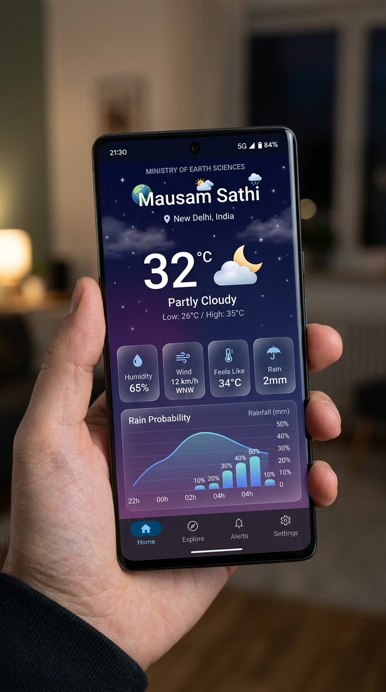

<div align="center">



# 🌦️ Mausam Sathi

### *Your Personal Weather Intelligence Companion*

**An AI-powered hyperlocal weather app built for India's diverse needs**

[](https://moes.gov.in)
[](https://www.sih.gov.in)
[](https://mauamai-production.up.railway.app)
[](https://github.com/Code-Ninja007/MauamAI/releases)

</div>

---

## 📱 About

**Mausam Sathi** (मौसम साथी) is a hyperlocal, persona-driven weather intelligence app developed for the **Smart India Hackathon 2024** under the **Ministry of Earth Sciences** problem statement.

Unlike generic weather apps, Mausam Sathi understands *who you are* and *what you need to do today* — delivering weather insights tailored specifically to your lifestyle.

---

## ✨ Key Features

| Feature | Description |
|---|---|
| 🎭 **8 Smart Personas** | Fitness, Health, Commuter, Agriculture, Traveler, Beach/Surf, Family, Event Planner |
| 🤖 **AI-Derived Widgets** | Persona-specific insights: best run time, pollen risk, harvest window, packing guide |
| 🌡️ **Dynamic Backgrounds** | UI gradient changes in real-time based on actual weather (Sunny, Rainy, Foggy, Night) |
| 📍 **Auto-Location** | GPS-based auto-detection with manual city search |
| 🗺️ **Travel Route Weather** | Compare weather at Start → En Route → Destination |
| 📊 **Rain Curve Graph** | Hourly rainfall probability visualized as a smooth SVG curve |
| 🌐 **Live Backend** | FastAPI backend deployed on Railway, refreshing every 10 minutes |
| 🎨 **Glassmorphic UI** | Frosted glass cards, smooth animations, readable on all backgrounds |
| 📴 **True Native App** | Fully standalone Android APK — no Expo wrapper needed |

---

## 🏗️ Architecture

```
Mausam Sathi
├── 📱 Frontend (React Native / Expo)
│   ├── Expo Router (full-screen, no tabs wrapper)
│   ├── expo-linear-gradient (dynamic weather backgrounds)
│   ├── react-native-svg (rain probability curve)
│   └── OpenWeatherMap → FastAPI → React Native
│
├── ⚙️ Backend (FastAPI / Python)
│   ├── main.py          — REST API + 10-min weather cache
│   ├── scoring_engine.py — AI persona scoring with real rain data
│   ├── weather_api.py   — OpenWeatherMap wrapper
│   └── database.py      — SQLite / PostgreSQL via SQLAlchemy
│
└── 🌐 Infrastructure
    ├── Railway.app      — Backend hosting (auto-deploy on push)
    └── GitHub Releases  — APK distribution
```

---

## 🚀 Quick Start

### Prerequisites
- Python 3.10+
- Node.js 18+
- Android phone for testing

### 1️⃣ Clone the Repo
```bash
git clone https://github.com/Code-Ninja007/MauamAI.git
cd MauamAI
```

### 2️⃣ Run the Backend
```bash
cd backend
python -m venv venv

# Windows
.\venv\Scripts\activate
# Mac/Linux
source venv/bin/activate

pip install -r requirements.txt
uvicorn main:app --host 0.0.0.0 --port 8000 --reload
```
> The live backend is already running at `https://mauamai-production.up.railway.app` — you only need this for local development.

### 3️⃣ Run the Frontend
```bash
cd frontend
npm install
npm start
```

Scan the QR code with [Expo Go](https://expo.dev/go) or build a native APK (see below).

---

## 📦 Build Native APK

To produce a standalone Android APK without Expo Go:

```bash
cd frontend

# 1. Generate Android project
npx expo prebuild -p android

# 2. Create local.properties with your SDK path
echo "sdk.dir=C:\Users\YOUR_NAME\AppData\Local\Android\Sdk" > android/local.properties

# 3. Build the release APK
cd android
.\gradlew assembleRelease
```

APK will be at: `android/app/build/outputs/apk/release/app-release.apk`

> **Windows users:** Build from a folder outside OneDrive (e.g. `C:\MausamBuild\`) to avoid path length and file-locking issues.

---

## 🔑 Environment Variables

| Variable | Location | Description |
|---|---|---|
| `WEATHER_API_KEY` | `backend/.env` | OpenWeatherMap API key (free tier works) |
| `DATABASE_URL` | `backend/.env` | PostgreSQL URL (defaults to SQLite) |
| `BACKEND_URL` | `frontend/.env` | Backend base URL |

Copy `backend/.env.example` to `backend/.env` and fill in your values.

---

## 🛠️ Tech Stack

| Layer | Technology |
|---|---|
| 📱 Mobile App | React Native (Expo), TypeScript |
| ⚙️ Backend API | FastAPI (Python 3.10) |
| 🗄️ Database | SQLite (local) / PostgreSQL (production) |
| 🌦️ Weather Data | OpenWeatherMap API |
| 🎨 UI | expo-linear-gradient, react-native-svg, React Native Animated |
| ☁️ Backend Hosting | Railway.app |
| 📦 APK Distribution | GitHub Releases |

---

## 📂 Project Structure

```
MauamAI/
├── backend/
│   ├── main.py              # FastAPI app + 10-min weather cache
│   ├── database.py          # SQLAlchemy models
│   ├── weather_api.py       # OpenWeatherMap integration
│   ├── scoring_engine.py    # AI persona scoring engine
│   ├── requirements.txt
│   └── .env.example
├── frontend/
│   ├── src/app/
│   │   ├── index.tsx        # Main app screen (all UI)
│   │   └── _layout.tsx      # Full-screen stack navigator
│   ├── src/components/      # Reusable components
│   ├── assets/images/       # App icon, splash screen
│   └── app.json             # Expo config
├── assets/
│   └── screenshot.jpg       # App preview
├── .gitignore
├── railway.toml             # Railway auto-deploy config
└── README.md
```

---

## ✅ Team Checklist

- [x] Backend deployed on Railway
- [x] APK published on GitHub Releases
- [x] Custom app icon + splash screen
- [x] 8 personas with unique AI widgets
- [x] Travel route weather feature
- [x] Onboarding flow (name + location + persona)
- [x] Dynamic weather-based UI backgrounds
- [x] Ministry of Earth Sciences branding
- [x] True native full-screen APK (no Expo wrapper)
- [x] Real rainfall data in scoring engine
- [x] 10-minute backend cache for fresh data
- [ ] Real OpenWeatherMap API key (production)
- [ ] PostgreSQL on Railway
- [ ] Play Store submission

---

## 🤝 Contributing

1. Fork this repo
2. Create a branch: `git checkout -b feature/your-feature-name`
3. Commit your changes: `git commit -m "feat: describe your change"`
4. Push and open a **Pull Request**

---

<div align="center">

**Built with ❤️ for Smart India Hackathon 2024**

*Ministry of Earth Sciences | Mausam Sathi Team*

</div>
